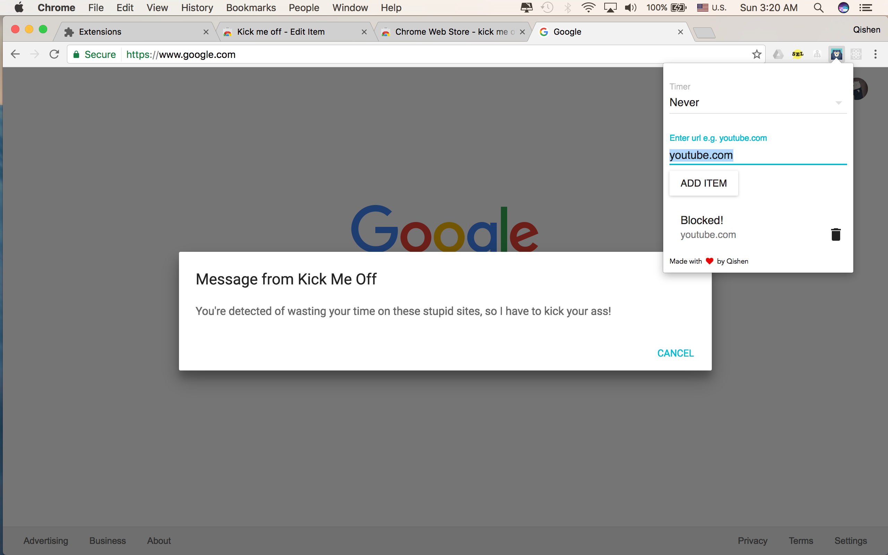

# Kick Me Off
## Description
Time is money, start saving your life today! `Kick me off` is a chrome extension to help people with procrastination to save time and improve productivity by automatically shutting down websites at your choices and pop up alerts. `localStorage` is used to save and reload your blacklist after reopen or quit of browser.



## Quick Start
Simply clone the repo and install all the dependencies in `package.json`
```
npm install
```

Start development mode using [webpack](https://webpack.github.io) with automatical rebuild.
```
./node_modules/.bin/webpack -d --watch
```
Or
```
npm run build
```

For chrome extension users, either load root directory into your browser or search and install it from [Chrome Webstore](https://chrome.google.com/webstore/category/extensions).

## Collaboration
Contributions are welcome! Shoot me a email or submit some PRs to get more involved. Also, implementation for Safari or Firefox extension will be highly appreciated!
